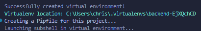

# Backend
## First we must set up the environment. 

We use a virtual environment to make sure our packages are independently used for this project only. Basically we are isolating pip installs.

We use pipenv to set up virtual environment
 - pip install pipenv
 - pipenv shell

Next open command pallet and go to "Python select interpreter" and add the VE location as seen below.

 

Here we install the packages needed for the app
 - pipenv install flask flask-sqlalchemy psycopg2 python-dotenv flask-cors

Next we can run our app using and add the file .flaskenv to set up debug mode and other helpful commands
 - flask run

# Frontend

Create boiler plate react app in frontend folder

- npx create-react-app frontend

Go to fronend dir and add some libraries
- cd forntend
- npm i axios date-fns

start up dev server
- npm start

